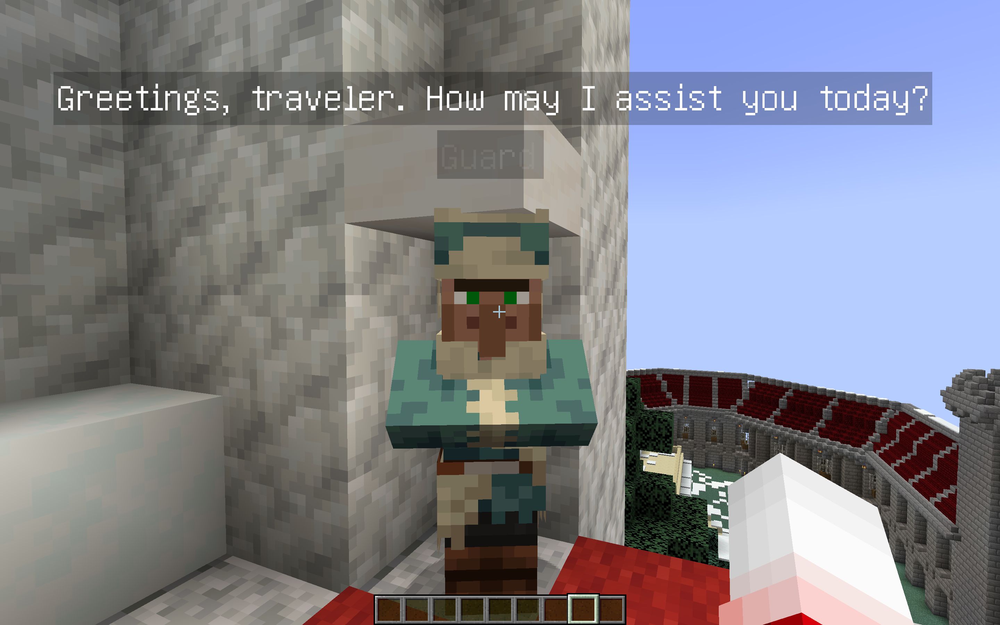
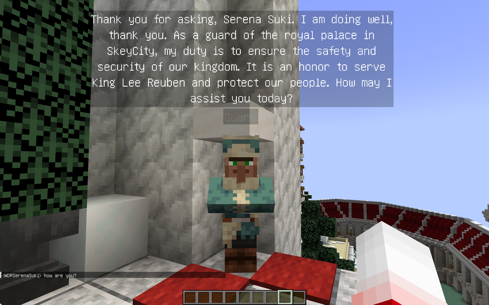

# Chat-with-NPC


> The mod is still in beta, please submit an issue if you find any problems. If you want to use the latest version,
> please compile the source code yourself, see [Build](#8-build).

[Chinese Version](docs/README_zh.md)

## 1. Introduction

**Chat With NPC** allows players to freely chat with NPCs, who will answer questions based on his setting (Basic Prompt)
and the setting of their Groups (Nation, City, Town ,etc.). Suitable for RPG maps or puzzle maps. The NPCs would not
change the game rule (if you don't use the advanced features). NPC can also perform some actions based on the chat
content if you define it.

In the future version, we will add innovative features such as NPCs chatting with each other, NPCs' viewpoints on
events, etc., so that NPCs in the same Group can interact with each other.

## 2. How to use

Any player can **talk to NPCs by shift+clicking** on them, if the NPC has been registered by OPs. Then the NPC will
greet with players.

The NPC's speech can be seen by everyone (in the **chat bubble** above their head), or by players within a certain range
around NPC (in the **Chat bar**).



Any nearby players can **reply to the NPC in the chat bar directly** (or the nearest NPC if there are multiple NPCs near
the player).



If you are administrator, see the [Installation](#5-installation) for more information.

## 3. Features

1. Each `NPC` has his own `Instructions`, and he can belong to a `Group`.
2. Each `NPC` can will manager their context of the conversation automatically by OpenAI.
3. Each `Group` also has its own `Instructions` to describe them, and can also record some `Event` that can be easy to
   change.
4. Each `Group` can record a `ParentGroup` until the group's parent group is `Global`, `Global` cannot have a parent
   group.
5. Each `NPC`'s conversation will combine his own `Instructions`, the context of this
   conversation (or all the conversation if needMemory is true), the `Intructions` of his `Group` and all
   its `ParentGroup`, and the content of `Event`.
6. You can define the `Functions` that could be call by the NPC in the conversation.

## 4. Requirements

- Minecraft Server 1.19.4 or higher
- Fabric Loader 0.12.0 or higher
- Fabric API included

## 5. Installation

1. After installing the mod in `mods` folder, grab your OpenAI API key
   from [here](https://platform.openai.com/api-keys), and set it with the `/npchat setkey <key>` command.
2. You can use the command in [Commands](#6-commands) to set the basic configuration of the mod.
3. For register the NPCs, please read [RegisterNPC](docs/RegisterNPC.md).
4. For register the Groups, please read [RegisterGroup](docs/RegisterGroup.md).
5. To know about the configuration of the mod, please read [Configuration](docs/Config.md).
6. If you want to use some advanced features, please read [Advanced](docs/Advanced.md).

## 6. Commands

- `/npchat` - View configuration status
- `/npchat help` - View commands help
- `/npchat enable/disable` - Enable/disable the mod
- `/npchat setKey <key>` - Set OpenAI API key
- `/npchat setModel <model>` - Set AI model
- `/npchat setRange <range>` - Set the range of the conversation
- `/npchat setLanguage <language>` - Set the response language
- `/npchat setWordLimit <wordLimit>` - Set the word limit of the response
- `/npchat setURL <url>` - Set the OpenAI API proxy URL
- `/npchat saveAll` - Save all the data to the disk
- `/npchat setChatBar <true/false>` - Set to display the conversation at the chat bat at the bottom left or not, `true` to display, `false` to hide.
- `/npchat setBubble <true/false>` - Set to display the bubble of the conversation above our lovely NPC or not, `true` to display, `false` to hide.
- `/npchat setBubbleStyle Color <color preset>` - Set the preset colors for font and background. 
- `/npchat setBubbleStyle timeLastingPerChar <time>` - Set the time lasting for a character in unit of second. For example, setting the time to 1.5 seconds means a sentence with 6 characters will have its bubble displayed for a total of 9 seconds.

## 7. To do list

- [X] Improve the chat bubble.
- [ ] NPCs chat with each other and communicate their opinion of events. (See [Advanced](docs/Advanced.md))
- [ ] NPCs have their opinion on every event in their `Group`.
- [X] NPCs performing actions based on the chat content. (See [Advanced](docs/Advanced.md))

## 8. Build

1. Clone the repository.
2. Run `./gradlew build` in the root directory of the repository.
3. The jar file will be generated in the `build/libs` directory.

## 9. Developer Notes

Developers can create their own custom functions by extending the `CustomFunction` class provided by the `ChatWithNPC`
API. For more information on creating custom functions, please refer to
the [Advanced Function Calling](docs/Advanced.md) documentation. Or, you can extend this mod and buildup your own chat with NPC style. 

- API Document: [javadoc](https://npchat.doc.ussjackdaw.com)
- API dependency configuration:
```groovy
repositories {
    maven {
        name = "Team-Jackdaw"
        url = uri("https://maven.ussjackdaw.com/repository/maven-releases/")
    }
}

dependencies {
    modImplementation "com.jackdaw:chat-with-NPC:${project.chat_with_npc_version}"
}
```

## 10. Reference

- [AIMobs](https://github.com/rebane2001/aimobs) by [rebane2001](https://github.com/rebane2001)
  and [Eianex](https://github.com/Eianex)
