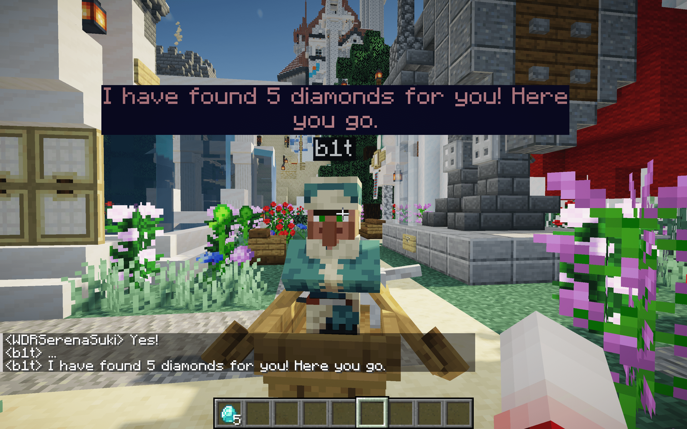

# Advanced Features

## 1. Function Calls (beta)

Function calls are an advanced feature of the OpenAI API that allows ChatGPT to call functions that may affect game
balance as an NPC at the appropriate time. The functions are defined by the server administrator, and the effects that
can be achieved are determined by you. For more information on this feature, see
the [OpenAI API documentation](https://beta.openai.com/docs/api-reference/function-calls/create-function-call).

For example, you can define a function called `give_diamond` that allows an NPC to call the `give_diamond` function when
a player talks to the NPC and expresses a desire for diamonds. You can also define more complex functions to implement
player-NPC "bargaining" interactions, etc.

Functions can be added or removed from NPCs using the following commands:

- `/npchat npc addFunction <function>` - Add a function to the NPC closest to you
- `/npchat npc deleteFunction <function>` - Remove a function from the NPC closest to you

**_!! Please note:_** These functions must be registered (in the code or in the configuration file) to take effect,
otherwise it will affect the operation of the entire mod.

Function calls can be implemented in two ways:

### 1. Implemented through code based on this mod API

This method requires you to write some mod code on the server side to implement the functions you define. The advantage
of this method is that it can implement very complex functions, but the disadvantage is that it requires you to have
some mod development experience.

> You can view the comments of the [`CustomFunction`](../src/main/java/com/jackdaw/chatwithnpc/openaiapi/function/CustomFunction.java)
> class to learn more about creating custom functions by extending this class and registering the function. You can
> compile this plugin to get the function functionality.
> - Development template: [NPCBasicFunction](https://github.com/Team-Jackdaw/NPCBasicFunction)
> - API documentation: [javadoc](http://npchat.doc.ussjackdaw.com)
> - Dependency configuration: [Developer Notes](../README.md/#9-developer-notes)

You can clone the template repository [NPCBasicFunction](https://github.com/Team-Jackdaw/NPCBasicFunction) to view the
example code.

Here is a simple example:

```java

public class GiveDiamondFunction extends CustomFunction {

    public GiveDiamondFunction() {
        description = "This function is used to give player a diamond. You can give player diamonds if you want.";
        properties = Map.of(
                "number", Map.of(
                        "type", "integer",
                        "description", "the number of diamonds to give to the player."
                )
        );
    }

    @Override
    public Map<String, String> execute(@NotNull ConversationHandler conversation, @NotNull Map<String, Object> args) {
        int number;
        try {
            number = (int) args.get("number");
        } catch (ClassCastException ignore) {
            try {
                double doubleNumber = Double.parseDouble(args.get("number").toString());
                number = (int) doubleNumber;
            } catch (NumberFormatException ignore2) {
                number = 1;
            }
        }
        ItemStack diamond = new ItemStack(Items.DIAMOND, number);
        conversation.getNpc().findNearbyPlayers(10).forEach(player -> player.giveItemStack(diamond));
        return Map.of("status", "success");
    }
}
```

In this example, we define a function named `give_diamond` that gives the player a certain number of diamonds. This
function takes a parameter `number`, which represents how many diamonds to give to the player. In the `execute` method,
this function is implemented. To teach ChatGPT to call this function, we need to describe the function's purpose in
the `description` in the constructor and explain the `properties` of the parameters in the form of a Map.

Don't forget to register this function in the static initialization method of the mod:

```java

public class NPCBasicFunction implements ModInitializer {
    @Override
    public void onInitialize() {
        // ...
        FunctionManager.registerFunction("give_diamond", new GiveDiamondFunction());
        // ...
    }
}
```

**_Effect Picture:_**

Giving Diamonds:


Come Here!:


Feeling Happy:


### 2. Implemented through configuration files

This method does not require you to write any Java code. You only need to define the function's purpose and parameters
in the configuration file and write the Minecraft command-related function in the map data packet in the map. The
advantage of this method is that it is simple and easy to use, but the disadvantage is that this method cannot return
complex results to OpenAI.

Here is a simple example:

Create a file named `open_door.json` in the `config/chatwithnpc/functions` directory with the following content:

```json
{
  "type": "function",
  "function": {
    "name": "open_door",
    "description": "This function is used to let you open the door or close the door.",
    "parameters": {
      "type": "object",
      "properties": {
        "willingness": {
          "type": "integer",
          "description": "If this parameter is 0, you will close the door. If it is 1, you will open the door.",
          "enum": [0, 1]
        }
      },
      "required": [
        "willingness"
      ]
    }
  },
  "call": "npchat:open_door"
}
```

In this example, we define a function named `open_door` that allows the NPC to open or close the door. This function
takes a parameter `willingness`, which indicates whether the NPC wants to open the door (`1`) or close the door (`0`).
To teach ChatGPT to call this function, we need to describe the function's purpose in the `description` and explain
the `properties` of the parameters.

When the NPC calls the function, it will first create one or more scoreboards `npc_<function_name>_<arg>` on the player
closest to the NPC to record the function parameters called by the NPC, then assign them to the player according to the
value of the parameters, and finally read the result scoreboard `npc_<function_name>_result`. 
If the scoreboard is created and the result of the nearest player is 0, it means failure, and the result will affect the 
NPC's response. If the function is not called or the scoreboard is not created or the scoreboard is 1, the result is successful.

Acceptable parameters:

- `type`: The type of the function, fixed as `function`
- `function`
    - `name`: The name of the function
    - `description`: The purpose of the function
    - `parameters`
        - `type`: The type of the parameter, fixed as `object`
        - `properties`
            - `key`: The name of the parameter (custom)
                - `type`: The type of the parameter, fixed as `integer`, and recorded in the scoreboard
                - `description`: The purpose of the parameter
                - `enum`: Optional values of the parameter (optional)
        - `required`: Parameters that the NPC must fill in (optional)
    - `call`: Minecraft map data packet Function for function calls (optional)

In addition, we also need to specify the Minecraft map data packet Function for the function call in `call`, in the form
of `<name_space>:<function_name>`. Please refer to the relevant Minecraft documentation for how to write the map data
packet.

Here is a simple example:

```mcfunction
# (In the directory /server/world/datapacks/npchat/data/npchat/functions/open_door.mcfunction)
# The parameter is 'npc_open_door_willingness', 0 means close the door, 1 means open the door

# Reset the player's result
execute run scoreboard players set @s npc_open_door_result 0

# Create a result scoreboard, which will be read by gpt
execute run scoreboard objectives add npc_open_door_result dummy

# Some other steps, such as checking if the player has permission, if there is a key, etc.
# ...

# Check the parameter, if it is 1, open the door (by removing a redstone block)
execute if entity @p[scores={npc_open_door_willingness=1}] run setblock -3812 125 2831 air

# Check the parameter, if it is 0, close the door (by placing a redstone block)
execute if entity @p[scores={npc_open_door_willingness=0}] run setblock -3812 125 2831 redstone_block

# After successful execution, set the result to 1
execute run scoreboard players set @s npc_open_door_result 1
```

All functions in the `config/chatwithnpc/functions` directory will be automatically registered when the server starts.
If you need to hot reload during server startup, you can use `/npchat saveAll` to reload.

Don't forget to add this function to the NPC.

**_Effect Picture:_**


## 2. NPC Conversation (dev)

This feature allows NPCs to communicate with each other and convey their opinions on events. This feature can make your
server more vivid and interesting. This feature is still under development. We plan to put this part in
[NPConversation](https://github.com/Team-Jackdaw/NPConversation).

**_Effect Picture:_**


