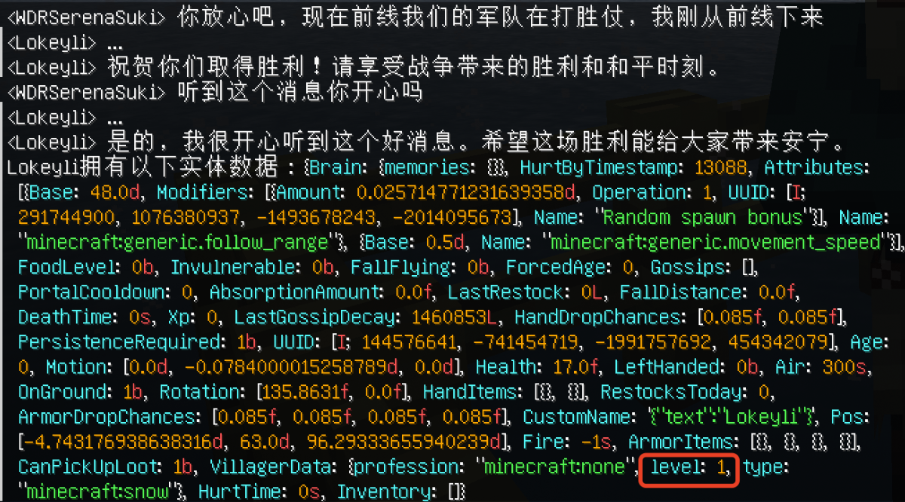

# 高级功能

## 1. 函数调用

函数调用是OpenAI API的一个高级功能，它允许ChatGPT在适当的时候以NPC的身份调用这些可能影响游戏平衡的函数，函数由服务器管理员定义，它可以达到的效果由您来决定。详细关于该功能的介绍请参见[OpenAI API文档](https://beta.openai.com/docs/api-reference/function-calls/create-function-call)。

比如说，您可以定义一个名为`give_diamond`的函数，当玩家向NPC对话时表现出他想要钻石时，NPC可以调用`give_diamond`函数来实现这个功能。再比如，您可以定义一些比较复杂的函数来实现玩家与NPC之间的“讨价还价”功能，等等。

在游戏中可以通过一下命令增减NPC可以调用的函数：

- `/npchat npc addFunction <function>` - 为离你最近的NPC添加一个函数
- `/npchat npc deleteFunction <function>` - 为离你最近的NPC移除一个函数

**_！！请注意：_**这些函数都必须已经注册（在代码中或者在配置文件中）才能生效，否则会影响整个mod的运行。

函数调用可以有两种方式实现：

### 1. 通过基于本mod api的代码实现

这种方式需要您在服务器端编写一些mod代码，以实现您定义的函数。这种方式的优点是可以实现非常复杂的功能，缺点是需要您有一定的mod开发经验。

>我们会在晚些时候开放mod api的文档，以便您可以更好地基于本mod api进行二次开发。目前，您可以克隆本mod的源代码，查看[`src/main/java/com/jackdaw/chatwithnpc/openaiapi/functioncalling/CustomFunction`](../src/main/java/com/jackdaw/chatwithnpc/openaiapi/functioncalling/CustomFunction.java)类的注释，继承该类并注册函数，在编译本插件来获得该函数功能。

以下是一个简单的示例：

```java
public class GiveDiamondFunction extends CustomFunction {

    public GiveDiamondFunction() {
        description = "This function is used to give player a diamond. If the player make a request to the NPC to give them some diamonds, this function will be called.";
        properties = Map.of(
                "number", "the number of diamonds to give to the player."
        );
    }

    @Override
    public Map<String, String> execute(@NotNull ConversationHandler conversation, @NotNull Map<String, String> args) {
        int number;
        try{
            number = Integer.parseInt(args.get("number"));
        } catch (NumberFormatException e) {
            number = 1;
        }
        ItemStack diamond = new ItemStack(Items.DIAMOND, number);
        conversation.getNpc().findNearbyPlayers(10).forEach(player -> player.giveItemStack(diamond));
        return Map.of("status", "success");
    }
}
```

在这个例子中，我们定义了一个名为`give_diamond`的函数，它的作用是给玩家一定数量的钻石。这个函数接受一个参数`number`，表示要给玩家多少个钻石。在`execute`方法中，实现了这个功能。为了让ChatGPT学会调用这个函数，我们需要在构造函数中的`description`中写明这个函数的作用，以及它接受的参数`properties`的解释（参数以Map表的形式储存）。

不要忘记在mod的静态初始化方法中注册这个函数：

```java
public class ChatWithNPCMod implements ModInitializer {
    @Override
    public void onInitialize() {
        // ...
        FunctionManager.registerFunction("give_diamond", new GiveDiamondFunction());
        // ...
    }
}
```

**_效果图：_**


### 2. 通过配置文件实现

这种方式不需要您编写任何代码，只需要在配置文件中定义函数的作用和参数即可。这种方式的优点是简单易用，缺点是这种方法本身并不能被实现和执行，但可以通过参数将信息传递到NPC实体的NBT数据中。从而在游戏中通过“修改地图数据包”，“命令方块”等方法实现函数调用（这里不在展示）。

以下是一个简单的示例：

在`config/chatwithnpc/functions`目录下创建一个名为`setNPCHappy.json`的文件（文件名一定要与函数名对应），内容如下：

```json
{
  "type": "function",
  "function": {
    "name": "setNPCHappy",
    "description": "This function is used to indicate that the NPC is happy now.",
    "parameters": {
      "type": "object",
      "properties": {
        "level": {
          "type": "string",
          "description": "How happy is the NPC, choose a floating point number from 0 to 1."
        }
      },
      "required": ["level"]
    }
  }
}
```

在这个例子中，我们定义了一个名为`setNPCHappy`的函数，它的作用是让NPC变得开心（实际上开心只是记录在NPC的NBT数据中的一个键值对）。这个函数接受一个参数`level`，表示NPC有多开心。为了让ChatGPT学会调用这个函数，我们需要`description`中写明这个函数的作用，以及它接受的参数properties的解释。

服务器启动时将自动注册在`config/chatwithnpc/functions`目录下的所有函数。

**_效果图：_**

