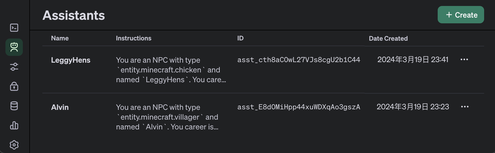

# Settings

## 1. Configuration File

The configuration file of the mod is stored in the `chat-with-npc` folder in the plugin directory. The file name is
the `config.json`. The content of the file is as follows:

```json
{
  "lastVersion": "v2.5",
  "enabled": true,
  "range": 10.0,
  "language": "Chinese",
  "apiKey": "sk-XXXXXXXXXXXXXXXXXXXXXXXXXXXXXXXXXXXXXXXX",
  "model": "gpt-3.5-turbo",
  "apiURL": "api.openai.com",
  "isBubble": true,
  "isChatBar": true,
  "maxTokens": 512
}
```

You can set the parameters below:

- `range`: how far the players can see and talk to the NPC.
- `language`: which language the NPC will use to talk to the player.
- `model`: the model of OpenAI
- `apiURL`: you can use the proxy to access the OpenAI API.
- `maxTokens`: the maximum tokens to use for each conversation.
- `isBubble`: whether to show the bubble above the NPC.
- `isChatBar`: whether to show the chat of the NPC in the chat bar of the player.

## 2. Manage you Assistant in OpenAI platform

Once you create a new NPC, you will see the Assistant in your OpenAI platform as below:



You can access to the OpenAI platform to manage, use and test your NPCs in
the [OpenAI platform Assistant](https://platform.openai.com/assistants).

**IMPORTANT: You have to also set everything in you NPC configuration file in the mod direction. Or you will lose your
setting.**

## 3. Introduction of the structure of the mod

This document is about some basic settings of the plugin, which can help users to use the plugin well, or to develop the
plugin within the scope of the license. The plugin has the following parts:

1. Conversation manager
2. Group manager
3. NPCEntity manager
4. Lifecycle manager

And some basic settings:

- All times of this plugin are in **milliseconds**, recorded by `Long` type.

## 4. Conversation manager

The Conversation manager is the core part of the plugin, which is responsible for managing all conversations. The main
settings of the Conversation are:

- `ConversationManager` stores all `ConversationHandler`, which is the current conversation of an NPC, and provides
  methods to activate, extract, and delete conversations.
- `ConversationHandler` contains an `NPCEntity` member, the time `updateTime` of the last conversation, and whether the
  current NPC is talking `isTalking`.
- When a player activates a `ConversationHandler`, the `ConversationManager` will first activate the NPC
  through `NPCEntityManager`, assign the `NPCEntity` to the `ConversationHandler`, and request the model to greet the
  player.
- When the NPC is asynchronously requesting information from the model, `isTalking` will be set to `true` until the
  model returns the result, and `updateTime` will be updated.
- When a `ConversationHandler` is unloaded, the manager will firstly end the NPC through `NPCEntityManager`, and then
  remove the current conversation through `ConversationManager`.
- That is, the lifecycle of `NPCEntity` is managed by `ConversationManager` and attached to `ConversationHandler` (
  temporarily).
- The lifecycle of `ConversationHandler` is managed by the plugin lifecycle manager.

## 5. Group manager

The Group manager is responsible for managing all Groups, and the main settings of the Group are:

- `GroupManager` stores all `Group` and provides methods to activate, extract, and delete Groups.
- `Group` contains a last load time `lastLoadTime`, and some settings `parentGroup`, `permanentPrompt`, `tempEvent`.
- `Group` is only activated when the `ConversationHandle` requests information from the model, or when an OP uses a
  command to view and modify a Group.
- The lifecycle of `Group` is managed by the plugin lifecycle manager.

Other settings:

- The `tempEvent` of `Group` is a temporary event collection. After an OP uses a command to add a temporary event, the
  event will expire **7 days later**.
- The `permanentPrompt` of `Group` is a **permanent** event collection. After an OP uses a command to add a permanent
  event, the event will exist until the OP uses a command to delete the event.
- The `parentGroup` of `Group` is a parent Group, and in general, all `Group` will eventually point to `Global`.

## 6. NPCEntity manager

The NPCEntity manager is responsible for managing all NPCEntity, and the main settings of NPCEntity are:

- `NPCEntityManager` stores all `NPCEntity` and provides methods to activate, extract, and delete NPCEntity.
- `NPCEntity` contains a `TextBubbleEntity`, and some settings `Career`, `instructions`, `Group`, `longTermMemory`.
- `NPCEntity` is activated when the `ConversationHandler` is activated, and unloaded when the `ConversationHandler` is
  unloaded, and the lifecycle is managed by `ConversationManager`.

Other settings:

- The `TextBubbleEntity` of `NPCEntity` is a text bubble, managed by `NPCEntity`, which will be loaded when the NPC is
  activated, and unloaded when the NPC is unloaded.
- The `TextBubbleEntity` will be displayed **0.55 blocks** above the NPC, and when the NPC replies to the player, the
  bubble will be displayed normally for **10 seconds**, and then become transparent, but will not be unloaded (to be
  modified).

## 7. Lifecycle manager

The lifecycle manager is responsible for managing the lifecycle of all `ConversationHandler` and `Group`, and the main
settings are:

- `ConversationHandler` and `Group` are managed by the lifecycle manager, and the lifecycle manager provides methods to
  activate, extract, and delete `ConversationHandler` and `Group`.
- The lifecycle manager will automatically delete the `ConversationHandler` and `Group` that have not been activated for
  a long time, and the time is set by the `forgetTime` of `NPCEntity` and `Group`.
- All `ConversationHandlers` and `Groups` can be unloaded asynchronously with the command `/npc saveAll`.
