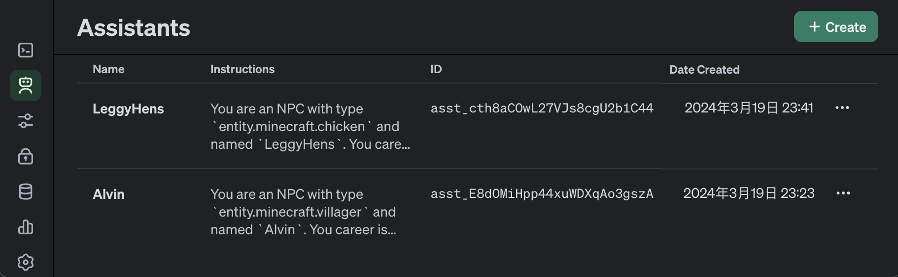

# 设定

## 1. 配置文件

插件的配置文件存储在插件目录下的`chat-with-npc`文件夹中，文件名为`config.json`。文件的内容如下：

```json
{
  "lastVersion": "v2.4",
  "enabled": true,
  "range": 10.0,
  "forgetTime": 86400000,
  "language": "Chinese",
  "apiKey": "sk-XXXXXXXXXXXXXXXXXXXXXXXXXXXXXXXXXXXXXXXX",
  "model": "gpt-3.5-turbo",
  "apiURL": "api.openai.com",
  "isBubble": true,
  "isChatBar": true,
  "maxTokens": 512
}
```

您可以设置以下参数：

- `range`：玩家可以看到和与NPC交谈的距离。
- `forgetTime`：遗忘`longTermMemory`的时间。
- `language`：NPC用来与玩家交谈的语言。
- `model`：OpenAI的模型。
- `apiURL`：您可以使用代理访问OpenAI API。（适合在中国大陆地区使用本mod的服务器）
- `maxTokens`：每次对话使用的最大令牌数。
- `isBubble`：是否在NPC上方显示气泡。
- `isChatBar`：是否在玩家的聊天栏中显示NPC的聊天。

## 2. 在OpenAI平台中管理您的助手

一旦您创建了一个新的NPC，您将在OpenAI平台中看到助手如下：



您可以访问OpenAI平台来管理、使用和测试您的NPC，[OpenAI平台助手](https://platform.openai.com/assistants)。

**重要：您还必须在插件目录下的NPC配置文件中设置所有内容。否则你会失去所有设定。**

## 3. 介绍

本文档是关于插件一些基础设定的说明，这些基础设定可以很好的帮助用户使用本插件，或者在许可证范围内进行二次开发。该插件有以下部分：

1. Conversation管理器
2. Group管理器
3. NPCEntity管理器
4. 生命周期管理器

以及一些基础设定：

- 本插件所有时间均以**毫秒**为单位， 由`Long`类型记录。

## 4. Conversation管理器

Conversation管理器是插件的核心部分，它负责管理所有的对话。Conversation的主要设定有：

- `ConversationManager`储存所有的`ConversationHandler`，即一个NPC的当前会话，并且提供激活、提取、删除会话的方法。
- `ConversationHandler`包含一个`NPCEntity`成员，当前会话的历史记录`messageRecord`，最近一次对话的时间`updateTime`，当前NPC是否正在讲话`isTalking`。
- 当玩家激活一个`ConversationHandler`时，`ConversationManager`会先通过`NPCEntityManager`激活该NPC，并将该`NPCEntity`赋予到`ConversationHandler`中，并请求模型向玩家打招呼。
- 当NPC正在向模型异步请求信息时，`isTalking`会被置为`true`直到模型返回结果，并且`updateTime`会被更新。
- 当一个`ConversationHandler`被卸载时，会先将当前会话记录`messageRecord`发送至模型中，模型会对该记录进行压缩提取并生成一个长读不超过30词的`longTermMemory`对象储存在`NPCEntity`中，再通过`NPCEntityManager`结束该NPC，然后通过`ConversationManager`将当前会话移除。
- 也就是说`NPCEntity`的生命周期由`ConversationManager`管理，并依附于`ConversationHandler`（暂时）。
- `ConversationHandler`的生命周期由插件生命周期管理器管理。

## 5. Group管理器

Group管理器负责管理所有的Group，Group的主要设定有：

- `GroupManager`储存所有的`Group`，并提供激活、提取、删除Group的方法。
- `Group`包含一个最后加载时间`lastLoadTime`，以及一些设定`parentGroup`, `permanentPrompt`, `tempEvent`。
- `Group`仅在`ConversationHandle`向模型请求信息前，生成Prompt时被激活，或者当OP使用指令查看和修改一个Group时被激活。
- `Group`的生命周期由插件生命周期管理器管理。

其他设定：

- `Group`的`tempEvent`是一个临时事件合集，OP使用指令添加一个临时事件后**7天后**该事件将会失效。
- `Group`的`permanentPrompt`是一个**永久**事件合集，OP使用指令添加一个永久事件后，该事件将会一直存在直到OP使用指令删除该事件。
- `Group`的`parentGroup`是一个父Group，一般情况下，所有`Group`最终将会指向`Global`。

## 6. NPCEntity管理器

NPCEntity管理器负责管理所有的NPCEntity，NPCEntity的主要设定有：

- `NPCEntityManager`储存所有的`NPCEntity`，并提供激活、提取、删除NPCEntity的方法。
- `NPCEntity`包含一个`TextBubbleEntity`，以及一些设定`Career`, `instructions`, `Group`, `longTermMemory`。
- `NPCEntity`在`ConversationHandler`被激活时激活，被卸载时卸载，生命周期由`ConversationManager`管理。

其他设定：

- `NPCEntity`的`longTermMemory`是一个长期记忆，它是一个`ArrayList<Map<Long, String>>`类型的集合，用于储存每一次会话中`messageRecord`的压缩提取及其会话时间。每一条记录的时间与现实时间之差与`forgetTime`的比值为每一条记录**被遗忘的概率**，该遗忘事件将会发生在每一次NPC被卸载时。遗忘事件将会保留**最近20条记录**不被遗忘。
- `NPCEntity`的`TextBubbleEntity`是一个文本气泡，由`NPCEntity`管理，它会在NPC被激活时被加载，被卸载时卸载。
- `TextBubbleEntity`会显示在NPC的上方**0.55格**处，当NPC回复玩家时，气泡会正常显示**10秒钟**，然后变成透明，但不会被卸载（待修改）。

## 7. 生命周期管理器

生命周期管理器负责管理所有`ConversationHandler`和`Group`的生命周期，它的主要设定有：

- 自插件被加载后，生命周期管理器将会被异步加载，**每30秒**检查一次所有的`ConversationHandler`和`Group`，并且将会卸载那些**超过5分钟**没有被使用的实例。
- 服务器关闭时，生命周期管理器会关闭所有的`ConversationHandler`和`Group`，并关闭生命周期管理器线程。
- 通过指令`/npc reload`可以异步卸载所有的`ConversationHandler`和`Group`。