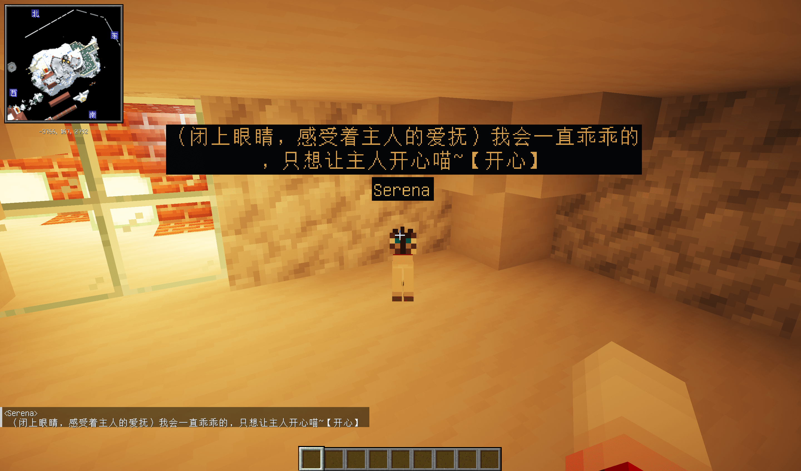
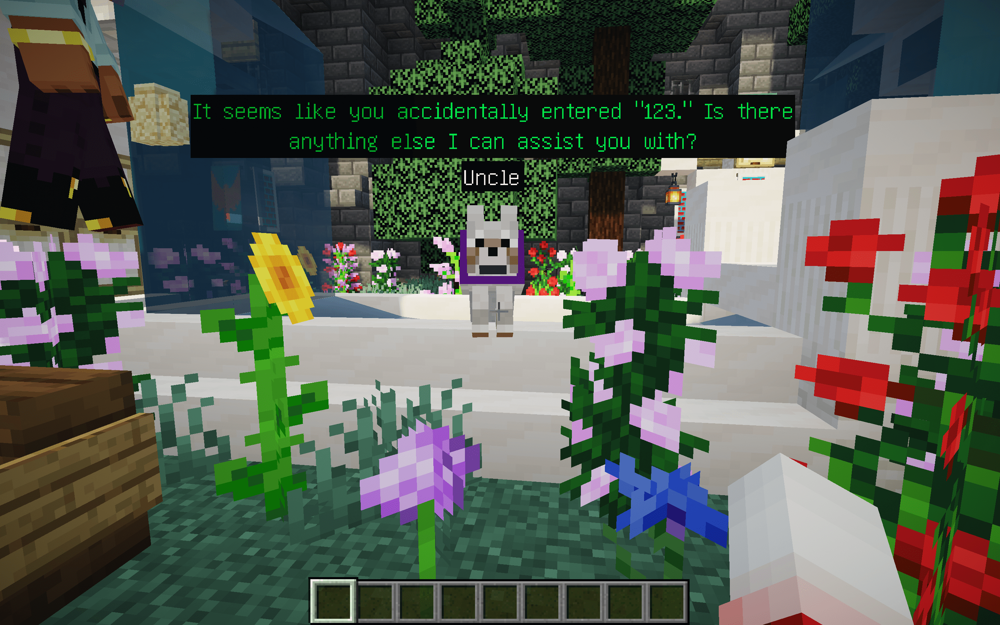

# Chat-with-NPC


> 该mod目前仍在测试阶段，请您发现任何问题及时提交issue。如果您想使用最新版本，请自行编译源代码，参见[构建](#8-构建)。


[English Version](../README.md)

## 1. 介绍

**Chat With NPC**
允许玩家自由地与NPC进行对话，NPC将根据其设置（基本提示）和其组（国家、城市、城镇等）的设置来回答问题。适用于RPG地图或谜题地图。NPC不会改变游戏规则，即实体的行为不受聊天内容的影响（如果不启用函数功能），这意味着即使在生存服务器上也可以使用它来使游戏更有趣。NPC也可以根据与玩家的聊天内容执行已经注册的动作。

在未来的版本中，我们将添加创新功能，例如NPC彼此聊天，NPC对事件的观点等，以便同一组中的NPC可以相互交互。

## 2. 如何使用

任何玩家都可以通过按住`Shift`键并点击NPC来与其交谈，如果NPC已由OP注册，则NPC将向玩家打招呼。

NPC的对话可以被所有人看到（在他们头顶的**聊天气泡**中），或者在NPC周围的一定范围内的玩家（在**聊天栏**中）。

任何附近的玩家都可以直接在聊天栏中回复NPC（如果玩家附近有多个NPC，则回复最近的NPC）。（养养猫娘什么的）





如果您是管理员，请参阅[安装](#5-安装)以获取更多信息。

## 3. 功能

1. 每个`NPC`都有自己的`Instructions`，并且可以属于一个`Group`。
2. 每个`NPC`可以自动管理他们的上下文，包括他们的记忆，如果记忆过长，那么早前的记忆会被自动压缩。
3. 每个`Group`都有自己的`Instructions`来描述它们，并且还可以记录一些`Event`表示这里正在发生的事情。
4. 每个`Group`都可以记录一个`ParentGroup`，直到该组的父组是`Global`，`Global`不能有父组。
5. 每个`NPC`的对话将结合他自己的`Instructions`，这次对话的上下文（如果设置了记住记忆，那么将包含所有上下文），他的`Group`
   及其所有`ParentGroup`的`Instructions`的内容，以及`Event`的内容。

## 4. 要求

- Minecraft Server 1.19.4 或更高版本
- Fabric Loader 0.12.0 或更高版本
- 包含Fabric API

## 5. 安装

1. 在`mods`文件夹中安装mod后，从[此处](https://platform.openai.com/api-keys)获取您的OpenAI
   API密钥，并使用`/npchat setkey <key>`命令设置它。
2. 您可以使用[命令](#6-命令)来设置mod的基本配置。
3. 要注册NPC，请阅读[RegisterNPC](RegisterNPC_zh.md)。
4. 要注册组，请阅读[RegisterGroup](RegisterGroup_zh.md)。
5. 要了解有关mod的配置，请阅读[配置](Config_zh.md)。
6. 要了解有关mod的高级功能，请阅读[高级功能](Advanced_zh.md)。

## 6. 命令

- `/npchat` - 查看配置状态
- `/npchat help` - 查看命令帮助
- `/npchat enable/disable` - 启用/禁用mod
- `/npchat setKey <key>` - 设置OpenAI API密钥
- `/npchat setModel <model>` - 设置AI模型
- `/npchat setRange <range>` - 设置对话范围
- `/npchat setLanguage <language>` - 设置响应语言
- `/npchat setWordLimit <wordLimit>` - 设置响应的字数限制
- `/npchat setURL <url>` - 设置OpenAI API代理URL
- `/npchat saveAll` - 将所有数据保存到磁盘
- `/npchat setChatBar <true/false>` - 设置是否在屏幕左下角的聊天栏中显示对话。设为true显示，设为false不显示。
- `/npchat setBubble <true/false>` - 设置是否在NPC头顶显示对话泡泡。设为true显示，设为false不显示。
- `/npchat setBubbleStyle Color <color preset>` - 设置对话泡泡的预设颜色，包括字体和背景颜色。
- `/npchat setBubbleStyle timeLastingPerChar <time>` - 设置对话泡泡中每个字符的显示时长，单位为秒。例如，如果每个字符的显示时间设置为1.5秒，那么一句含有6个字符的话语的泡泡将会持续9秒。


## 7. 待做列表

- [X] 改进聊天气泡。
- [ ] NPC之间可以相互聊天，并交流观点。 （请参阅[高级功能](Advanced_zh.md)）
- [ ] NPC会对他们所属的`Group`中的事件有自己的看法。
- [X] NPC会对聊天内容作出动作反应。 (请参阅[高级功能](Advanced_zh.md))

## 8. 构建

1. 克隆存储库。
2. 在存储库的根目录中运行`./gradlew build`。
3. jar文件将生成在`build/libs`目录中。

## 9. 开发者注意事项

开发者可以通过扩展`ChatWithNPC`提供的`CustomFunction`类来创建自己的自定义函数。有关创建自定义函数的更多信息，请参阅
[高级功能调用](Advanced_zh.md)文档。 或者，您可以扩展此mod并构建自己的NPC风格的聊天。

- API文档：[javadoc](http://npchat.doc.ussjackdaw.com)
- API依赖配置：
```groovy

repositories {
    maven {
        name = "Team-Jackdaw"
        url = uri("https://maven.ussjackdaw.com/repository/maven-releases/")
    }
}

dependencies {
    modImplementation "com.jackdaw:chat-with-npc:${project.chat_with_npc_version}"
}
```

## 10. 参考

- [AIMobs](https://github.com/rebane2001/aimobs) by [rebane2001](https://github.com/rebane2001)
  and [Eianex](https://github.com/Eianex)