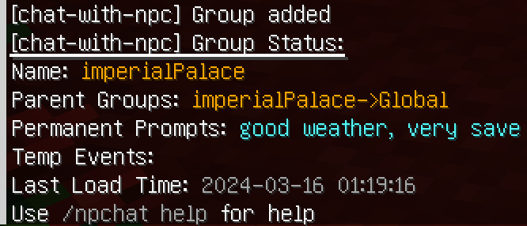

# Register Group

## 1. Basic Commands for Group

- `/npchat group` - View the information of all groups.
- `/npchat group <group>` - View the information of a group.
- `/npchat group <group> setParent <parent>` - Set the parent group for the group.
- `/npchat group <group> setInstructions <instructions>` - Set the instructions for the group.
- `/npchat group <group> addEvent <event>` - Add an event to the group.
- `/npchat group <group> popEvent` - Remove the most recent event from the group.
- `/npchat addGroup <newGroup>` - Add a new group

## 2. Steps to Register Group

1. **Create a Group**: Use the command `/npchat addGroup <newGroup>` to create a new group.

   > You can use the command `/npchat group <group>` to view the information of the group.
   

2. **Set the Parent Group**: Use the command `/npchat group <group> setParent <parent>` to set the parent group for the
   group.
3. **Add Instructions**: Use the command `/npchat group <group> setInstructions <instructions>` to add instructions to the
    group.
4. **Add Event**: Use the command `/npchat group <group> addEvent <event>` to add an event to the group.

   > 

5. **Add Group to an NPC**: Use the command `/npchat npc setGroup <group>` to add this group to an NPC. And then they
   will know everything about this group.
6. **Reload the Plugin and Save Data**: You may need to use `/npchat saveAll` to reload the plugin immediately and save
   this new NPC data (note that this will also unload all other conversations).

## 3. Rules for Group Setting

1. **Group Name**: The group name needs to meet the regular pattern `^[a-zA-Z0-9_-]{1,64}$`, that is, only alphanumeric,
   underscores, and dashes are allowed.
2. **Parent Group**: The parent group name must be registered.
3. **Permanent Prompt**: No restrictions, but English is recommended. It should be an adjective or descriptive sentence.
4. **Temporary Event**: No restrictions, but English is recommended. It should be a noun or noun phrase and sentence.

## 4. Group Example

- `name`: `imperial_palace`
- `parent`: `skey_city`
- `instructions`: `A palace located on a snowy mountain in the center of Skey City, the capital of the Scot Empire.`
- `Event`: `coronation ceremony`

## 5. Configuration File

The configuration file of the Group is stored in the `group` folder in this mod directory. The file name is
the `<groupName>.json`. The content of the file is as follows:

```json
{
   "name": "imperial_palace",
   "parentGroup": "skey_city",
   "instruction": "A palace located on a snowy mountain in the center of Skey City, the capital of the Scot Empire.",
   "event": ["coronation ceremony"],
   "memberList": [
      "Lokeyli"
   ]
}
```

_Note_: Please modify the file before you load the conversation or group. Please do not manually modify the content of
memberList, which is the member list of the NPC and is automatically maintained by the mod.


