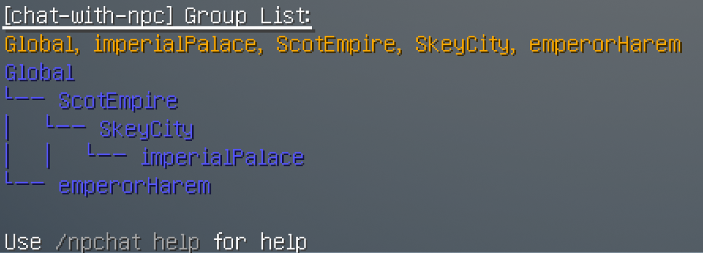

# 注册Group

## 1. 群组的基本命令

- `/npchat group` - 查看所有群组的信息。
- `/npchat group <group>` - 查看一个群组的信息。
- `/npchat group <group> setParent <parent>` - 设置群组的父级群组。
- `/npchat group <group> setInstructions <instructions>` - 设置群组的说明。
- `/npchat group <group> addEvent <event>` - 添加一个事件到群组。
- `/npchat group <group> popEvent` - 从群组中删除最近一条事件。
- `/npchat addGroup <newGroup>` - 添加一个新的群组

## 2. 注册群组的步骤

1. **创建群组**：使用命令 `/npchat addGroup <newGroup>` 创建一个新的群组。

   > 你可以使用 `/npchat group <group>` 命令查看群组的信息。
   

2. **设置父级群组**：使用命令 `/npchat group <group> setParent <parent>` 为群组设置父级群组（默认为`Global`）。
3. **添加说明**：使用命令 `/npchat group <group> setInstructions <instructions>` 为群组添加说明。
4. **添加事件**：使用命令 `/npchat group <group> addEvent <event>` 向群组添加事件。

   > 

5. **将群组添加到NPC**：使用命令 `/npchat npc setGroup <group>` 将该群组添加到某个NPC中。然后他们将了解有关该群组的一切。
6. **重新载入插件并保存数据**: 你也许需要使用 `/npchat saveAll` 立即重新载入插件并保存这个新的NPC数据（注意，这同时也会卸载其他所有会话）。

现在你已经完成了一个群组的注册。

## 3. 群组设置规则

1. **群组名称**：群组名称需要符合正则模式 `^[a-zA-Z0-9_-]{1,64}$`，即只允许使用字母、数字、下划线和破折号。
2. **父级群组**：父级群组名称必须已注册。
3. **永久提示**：没有限制，但建议使用英文。应该为形容词或形容语句。
4. **临时事件**：没有限制，但建议使用英文。应该为名词或名词短语和语句。

## 4. 群组示例

- `name`: `imperial_palace`
- `parent`: `skey_city`
- `instructions`: `A palace located on a snowy mountain in the center of Skey City, the capital of the Scot Empire.`
- `Event`: `coronation ceremony`

## 5. 配置文件

群组的配置文件存储在插件目录下的 `group` 文件夹中。文件名为 `<groupName>.json`。文件内容如下：

```json
{
  "name": "imperial_palace",
  "parentGroup": "skey_city",
  "instruction": "A palace located on a snowy mountain in the center of Skey City, the capital of the Scot Empire.",
  "event": ["coronation ceremony"],
  "memberList": [
    "Lokeyli"
  ]
}
```

_请注意_：在加载对话或群组之前，请修改文件。请不要手动修改memberList的内容，这是NPC的成员列表，由mod自动维护。
