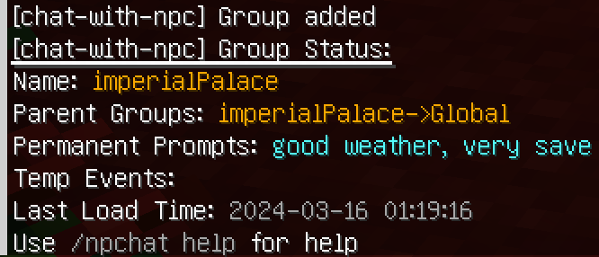
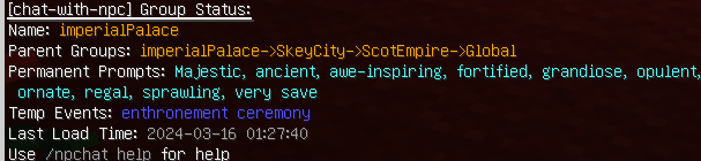

# 注册Group

## 1. 群组的基本命令

- `/npchat group <group>` - 查看一个群组的信息。
- `/npchat group <group> setParent <parent>` - 设置群组的父级群组。
- `/npchat group <group> addPermanentPrompt <prompt>` - 向群组添加一条永久提示（形容词或句）。
- `/npchat group <group> popPermanentPrompt` - 从群组中删除最近一条永久提示。
- `/npchat group <group> addTempEvent <event>` - 向群组添加一条临时事件（有效期现实7天）。
- `/npchat group <group> popTempEvent` - 从群组中删除最近一条临时事件。
- `/npchat addGroup <newGroup>` - 添加一个新的群组

## 2. 注册群组的步骤

1. **创建群组**：使用命令 `/npchat addGroup <newGroup>` 创建一个新的群组。

   > 你可以使用 `/npchat group <group>` 命令查看群组的信息。
   

2. **设置父级群组**：使用命令 `/npchat group <group> setParent <parent>` 为群组设置父级群组（默认为`Global`）。
3. **添加永久提示**：使用命令 `/npchat group <group> addPermanentPrompt <prompt>` 向群组添加永久提示。
4. **添加临时事件**：使用命令 `/npchat group <group> addTempEvent <event>` 向群组添加临时事件。

   > 

5. **将群组添加到NPC**：使用命令 `/npchat npc setGroup <group>` 将该群组添加到某个NPC中。然后他们将了解有关该群组的一切。
6. **重新载入插件并保存数据**: 你也许需要使用 `/npchat saveAll` 立即重新载入插件并保存这个新的NPC数据（注意，这同时也会卸载其他所有会话）。

现在你已经完成了一个群组的注册。

## 3. 群组设置规则

1. **群组名称**：群组名称需要符合正则模式 `^[a-zA-Z0-9_-]{1,64}$`，即只允许使用字母、数字、下划线和破折号。
2. **父级群组**：父级群组名称必须已注册。
3. **永久提示**：没有限制，但建议使用英文。应该为形容词或形容语句。
4. **临时事件**：没有限制，但建议使用英文。应该为名词或名词短语和语句。

## 4. 群组示例

- `name`: `imperialPalace`
- `parent`: `SkeyCity`
- `permanentPrompt`: `Majestic`, `ancient`, `opulent`, `grandiose`, `fortified`, `sprawling`, `ornate`, `regal`, `awe-inspiring`, `very save`
- `tempEvent`: `enthronement ceremony`

## 5. 配置文件

群组的配置文件存储在插件目录下的 `group` 文件夹中。文件名为 `<groupName>.json`。文件内容如下：

```json
{
  "name": "SkeyCity",
  "parentGroup": "ScotEmpire",
  "permanentPrompt": [
    "Historic",
    "capital of Scot Empire",
    "classical",
    "commercial",
    "cultural",
    "culturally-rich",
    "economically-strong",
    "expansive",
    "fortified",
    "historic",
    "industrial",
    "innovative",
    "inspiring",
    "large",
    "majestic",
    "modern",
    "opulent",
    "ornate",
    "regal",
    "sprawling",
    "thriving",
    "very safe"
  ],
  "tempEvent": [
    "coronation ceremony",
    "festival",
    "grand opening",
    "parade",
    "reception",
    "state dinner",
    "trade fair"
  ]
}
```

_请注意_：在加载对话或群组之前，请修改文件。
