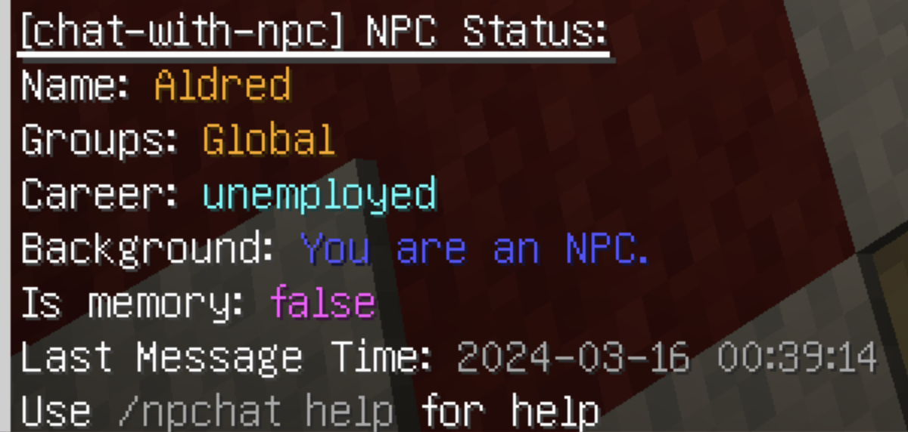
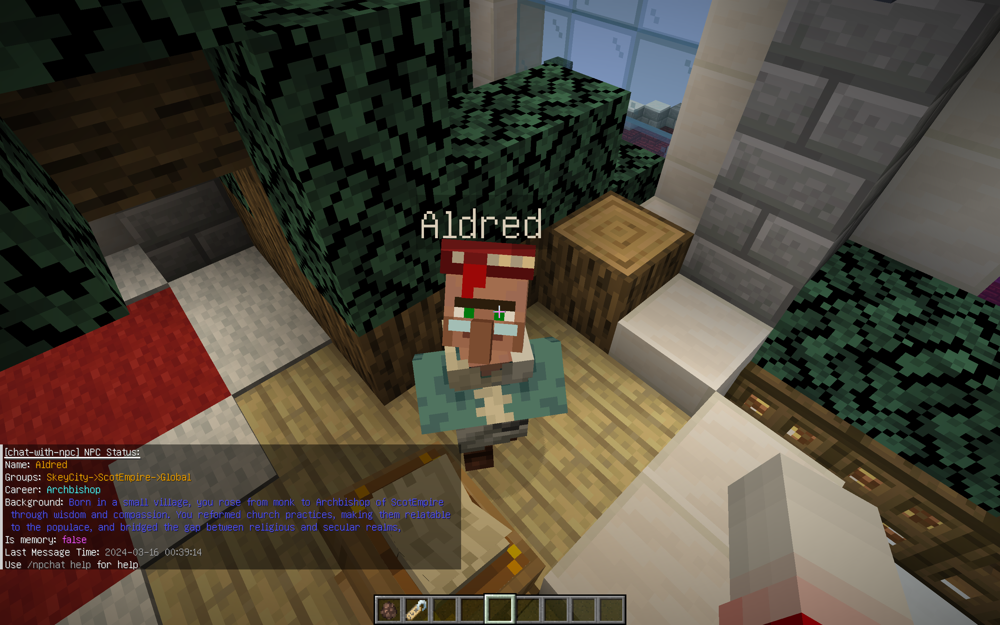

# Register NPC

## 1. Basic Commands for NPC

- `/npchat npc` - NPC status of the closest NPC.
- `/npchat npc setCareer <career>` - Set the career for the closest NPC.
- `/npchat npc setGroup <group>` - Set the group for the closest NPC.
- `/npchat npc setBackground <prompt>` - Set the background for the closest NPC.
- `/npchat npc clearMemory` - Clear the memory for the closest NPC.

## 2. Steps to Register NPC

1. **Create a NPC**: Place a new `LivingEntity` and name it with a `Name Tag`.
2. **Register the NPC**: If you are an OP, you can shift+clicking on the NPC to register it. Then the NPC will greet with you. Now, the NPC is registered with default settings.

    > You can use the command `/npchat npc` to check the status of the NPC.
    

3. **Set the Career**: You can use the command `/npchat npc setCareer <career>` to set the `Career` for the NPC. 
4. **Set the Group**: You can use the command `/npchat npc setGroup <group>` to set the `Group` for the NPC. To register a new group, please read [RegisterGroup](RegisterGroup.md).
5. **Set the Background**: You can use the command `/npchat npc setBackground <prompt>` to set the `BasicPrompt` for the NPC.
6. **Clear the Memory**: You can use the command `/npchat npc clearMemory` if you want to clear all the memory of the NPC.

    > 

7. **Reload the Plugin and Save the Data**: You may need to use `/npchat reload` to reload the plugin immediately and save the new NPC data (note that this will also unload all other sessions).

Now you have completed the registration of an NPC.

## 3. Rules for NPC Setting

1. **NPC's Name**: The NPC name needs to meet the regular pattern `^[a-zA-Z0-9_-]{1,64}$`, that is, only alphanumeric underscores and horizontal bars are allowed.
2. **NPC's Career**: No restrictions, but English is recommended.
3. **NPC's Group**: The group name must conform to the regular pattern `^[a-zA-Z0-9_-]{1,64}$`, that is, only alphanumeric underscores and dashes are allowed. Please see [RegisterGroup](RegisterGroup.md) for details.
4. **NPC's Background**: No restrictions, but English is recommended. Please describe the NPC in the second person. For example:

## 4. NPC Example

1. `name`: `Aldred`
2. `career`: `Archbishop`
3. `group`: `SkeyCity`
4. `background`:
    >Born in a small village, you rose from monk to Archbishop of ScotEmpire through wisdom and compassion. You reformed church practices, making them relatable to the populace, and bridged the gap between religious and secular realms, promoting peace and unity throughout the empire.
