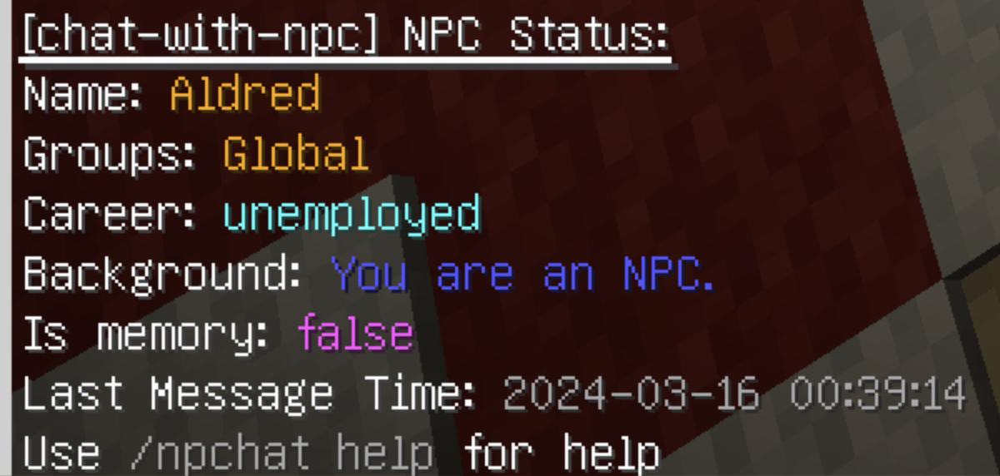

# 注册 NPC

## 1. NPC 的基本命令

- `/npchat npc` - 最近的 NPC 的状态。
- `/npchat npc setCareer <career>` - 为最近的 NPC 设置 `职业`。
- `/npchat npc setGroup <group>` - 为最近的 NPC 设置 `组`。
- `/npchat npc setInstructions <instructions>` - 为最近的 NPC 设置 `基础设定`。
- `/npchat npc isNeedMemory <isNeedMemory>` - 设置最近的 NPC 是否记录记忆。
- `/npchat npc clearMemory` - 清除最近的 NPC 的记忆。
- `/npchat npc update` - 上传最近的 NPC 的当前信息到 OpenAi。

## 2. 注册 NPC 的步骤

1. **创建 NPC**：放置一个新的 `生物实体` 并用 `命名牌` 命名。
2. **注册 NPC**：如果您是 OP，您可以按住 `Shift` 键并点击 NPC 以注册它。然后 NPC 将向您打招呼。现在，NPC 已使用默认设置注册。
    
    > 你可以使用 `/npchat npc` 命令查看 NPC 的状态。
    

3. **设置职业**：您可以使用命令 `/npchat npc setCareer <career>` 为 NPC 设置 `职业`。
4. **设置组**：您可以使用命令 `/npchat npc setGroup <group>` 为 NPC 设置 `组`。要注册新组，请阅读 [RegisterGroup](RegisterGroup_zh.md)。
5. **设置背景**：您可以使用命令 `/npchat npc setInstructions <instructions>` 为 NPC 设置 `基础设定`。
6. **更新设置到 OpenAI**：您可以使用命令 `/npchat npc update` 将 NPC 的当前信息上传到 OpenAI。
7. **清除记忆**：您可以使用命令 `/npchat npc clearMemory` 你也许希望清除 NPC 的所有记忆。

    >

8. **重新载入插件并保存数据**: 你也许需要使用 `/npchat saveAll` 立即重新载入插件并保存这个新的NPC数据（注意，这同时也会卸载其他所有会话）。

这时你完成了一个 NPC 的注册。

## 3. NPC 设置规则

1. **NPC的名称**：NPC的名称需要满足正则`^[a-zA-Z0-9_-]{1,64}$`，即仅限字母数字下划线和横杠。
2. **NPC的职业**：无限制，但推荐英文。
3. **NPC的组**：组名必须符合正则`^[a-zA-Z0-9_-]{1,64}$`，即仅限字母数字下划线和横杠。详情请看[RegisterGroup](RegisterGroup_zh.md)。
4. **NPC的基础设定**: 无限制，但推荐英文。请以第二人称的方式对NPC进行描述。

## 4. NPC 示例

1. `name`: `Aldred`
2. `career`: `Archbishop`
3. `group`: `SkeyCity`
4. `isNeedMemory`: `true`
5. `instructions`:
    >Born in a small village, you rose from monk to Archbishop of ScotEmpire through wisdom and compassion. You reformed church practices, making them relatable to the populace, and bridged the gap between religious and secular realms, promoting peace and unity throughout the empire.
   
## 5. 配置文件

NPC 的配置文件存储在插件目录下的 `npc` 文件夹中。文件名为 `<UUID>.json`。文件内容如下：

```json
{
  "name": "Alvin",
  "threadID": "thrd_XXXX",
  "assistantID": "asst_XXXX",
  "careers": "officer",
  "localGroup": "SkeyCity",
  "isNeedMemory": true,
  "instructions": "Born in a small village, you rose from monk to Archbishop of ScotEmpire through wisdom and compassion. You reformed church practices, making them relatable to the populace, and bridged the gap between religious and secular realms, promoting peace and unity throughout the empire."
}
```

_请注意_：请在加载对话之前修改文件。